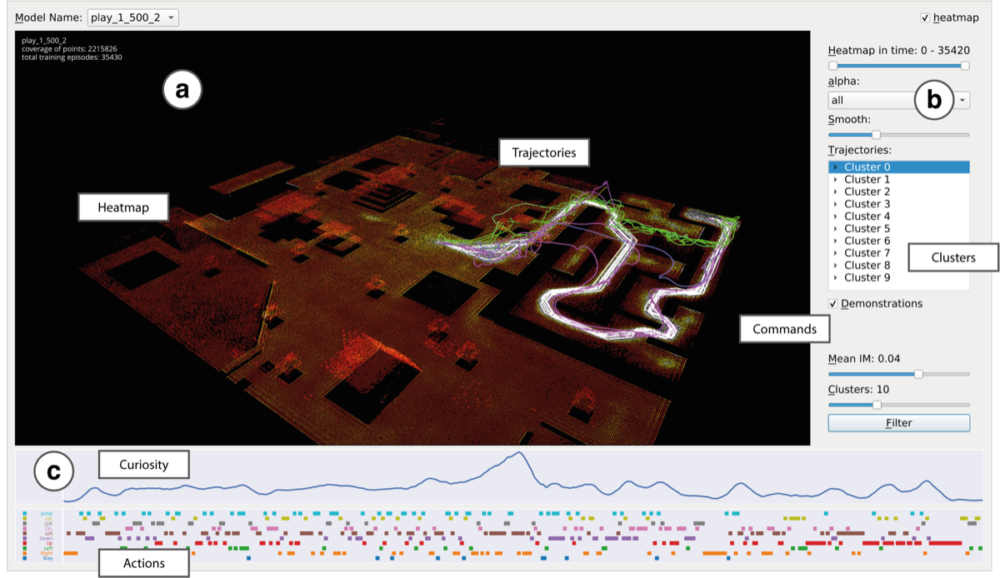

# VisCCPT
Official codebase for *"Automatic Gameplay Testing and Validation with Curiosity-Conditioned Proximal Trajectories"* paper.
Alessandro Sestini, Linus Gisslén, Joakim Bergdahl, Konrad Tollmar, and Andrew D. Bagdanov.

This repo contains the Visualization Tool for interpreting the results of the CCPT algorithm.

A link to our paper can be found in [arxiv](https://arxiv.org/pdf/2202.10057).

For the CCPT algorithm, see this [repo](https://github.com/SestoAle/CCPT).

<br/>
<p align="center">
    
</p>

# Prerequisites
* The code was tested with **Python v3.7**.
* To install all required packages:
```
git clone https://github.com/SestoAle/VisCCPT.git
cd VisCCPT
pip install -r requirements.txt
```
* To download the pre-made data:
```
python download_data.py
```
# Instruction
* To train the agent to playtest the environment, use the command:
```
python main.py
```
Follow the instructions on screen to use the tool, or look at the [paper](https://arxiv.org/pdf/2202.10057) for a complete 
description.

# Algorithm
To understand how the data are created, we suggest to visit the [```CPPT```](https://github.com/SestoAle/CCPT) repo, 
which contains the CCPT algorithm described  in the paper. 